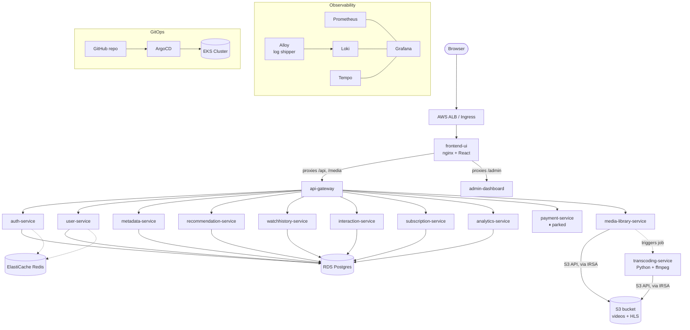

# MyFlix — Start Here

Read this first, every time you come back after a gap. It's meant to take 5 minutes, not re-teach you the whole project. For anything deeper, it points you to the other two documents at the bottom.

---

## What this actually is

**MyFlix** is a personal OTT (Netflix-style) streaming platform — 14 microservices, a database, media storage, the works. You're not building it because you need a streaming service; you're building it as a **deep-learning vehicle for production-grade Kubernetes and AWS**. The goal every step of the way has been to understand *why*, not just get it running, so you could rebuild any piece of it yourself from scratch if you had to. (You've actually had to — the whole thing got rebuilt once already after an AWS account got blocked.)

---

## Architecture, at a glance

**14 services**, in three groups:
- **Front doors:** `frontend-ui` (what users see), `admin-dashboard` (CMS/admin), `api-gateway` (routes everything internally)
- **Business logic (Go):** `auth`, `user`, `metadata`, `recommendation`, `watchhistory`, `interaction`, `subscription`, `analytics`, `payment` — each owns one concern, all talk to the same Postgres database
- **Media pipeline:** `media-library-service` (Go, lists/streams from S3) and `transcoding-service` (Python, ffmpeg — converts uploads into streamable HLS video)

**Infrastructure underneath:** EKS cluster (`myflix-eks`) → RDS Postgres + ElastiCache Redis (managed databases) → S3 (video storage) → an ALB (public entry point) → all wired together with IAM, Secrets Manager, and a full observability stack (Prometheus/Grafana/Loki/Tempo).

**How changes actually reach the cluster:** you edit YAML in a GitHub repo → ArgoCD notices → you review the diff → you click Sync → it applies. You (almost) never run `kubectl apply` directly anymore.

---

## Current status (as of the last session)

Fully rebuilt on a **second AWS account** (the first got blocked — unrelated to anything technical). 13 of 14 services running. `payment-service` is **intentionally** paused — it just needs real Razorpay API keys you don't have yet, not a bug. The logging pipeline was recently upgraded from Promtail to **Grafana Alloy** after a genuine, hard-to-diagnose bug. **CDN (CloudFront) is the one real unfinished feature** — paused at a specific decision (see glossary below).

---

## Glossary — the concepts you'll want refreshed most often

**IRSA** (IAM Roles for Service Accounts) — lets a Kubernetes pod act with real AWS permissions (e.g., read/write S3) without ever holding an AWS access key. Only `transcoding-service` and `media-library-service` need this — they're the only two that talk to AWS APIs directly.

**ESO** (External Secrets Operator) — the thing that pulls real secrets (DB passwords, API keys) out of AWS Secrets Manager and turns them into ordinary Kubernetes Secrets automatically. Real values live in exactly one place (Secrets Manager); nothing sensitive is ever in git.

**ArgoCD / GitOps** — `Synced` means the cluster matches git exactly. `OutOfSync` means git and the cluster disagree (fix: sync). `Degraded` refers to app **health**, not sync — right now it's permanently `Degraded` because `payment-service` isn't running, which is expected, not alarming.

**HPA** (Horizontal Pod Autoscaler) — automatically adds more replicas of a service under CPU load, scales back down when idle. Set on all 14 services, conservatively (max 3 replicas each) because of the node-capacity issue below.

**The recurring node-capacity ceiling** — the cheapest AWS instance type available to this account (`t3.small`) can only run **11 pods per node**, no matter how much CPU/memory is actually free — it's a hard networking limit (IP addresses per network interface), not a resource limit. This has caused real, repeated scheduling trouble (Promtail's DaemonSet couldn't fit, then ArgoCD couldn't fit) — solved each time by adding another node, never fully solved at the root.

**Why Alloy replaced Promtail** — Promtail (the old log-shipping tool) had a bug that made it silently find zero logs, on two separate clusters, never fully explained except "probably too old to talk to this new a Kubernetes version." Alloy is Grafana's modern replacement, and as a bonus it runs as **1 pod instead of 6** (a `Deployment`, not a `DaemonSet`), which also eases the capacity ceiling above.

**The CDN decision, paused mid-way** — CloudFront can't sit directly in front of just the S3 media bucket, because your login system uses cookies, and browsers won't let a cookie set on your app's domain apply to CloudFront's separate domain. The fix is either (a) one CloudFront distribution in front of *everything* (app + media, unifying the domain), or (b) getting a real custom domain. Neither has been built yet — this is genuinely still an open decision, not just unstarted work.

---

## Where to look for what

- **This document** — orientation after a gap. Read it first, always.
- **`eks-migration-runbook.md`** — the full history. Every bug, every decision, every "why," in the order it happened. Read a specific phase when you need the *reasoning* behind something.
- **`eks-rebuild-playbook.md`** — the exact commands to rebuild any piece from scratch, with every known gotcha already fixed in the instructions. Read this when you need to *do* something, not understand something.
